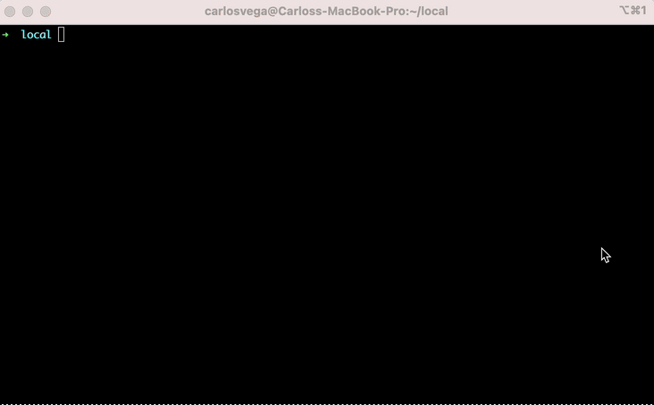
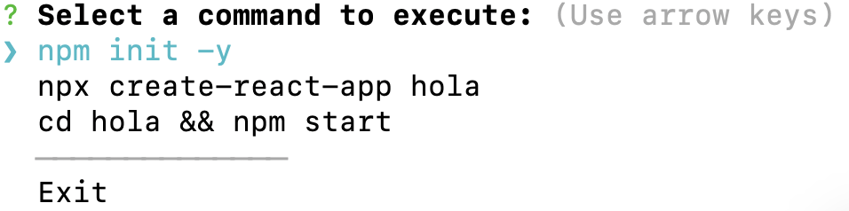
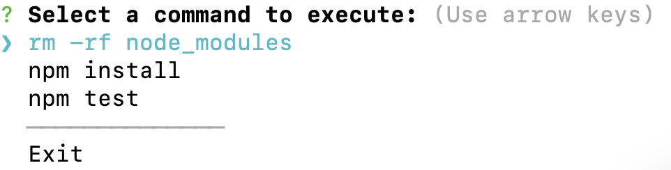
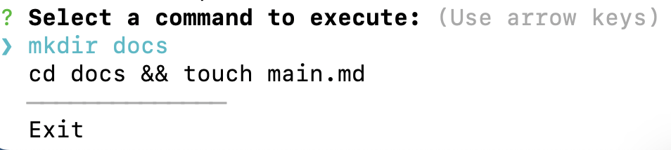

<div style="display: flex; justify-content: center;" align="center">
    
</div>

<div class="oranda-hide">

# npai

</div>

> Creates npm and bash commands based on Natural Language.

[](https://npm.im/npai) [](https://npm.im/npai)


## SYNOPSIS

`npai <natural language text...>`


## INSTALL

`npm install -g npai`

## DESCRIPTION

NPAI (NPM Command AI) is a revolutionary Command Line Interface (CLI) tool designed to simplify and enhance your experience with NPM commands. With NPAI, you can effortlessly master NPM commands with the power of Artificial Intelligence (AI) by your side. Say it, and NPAI will make it happen!

**The library needs to be configured with your chatGPT (openai) account's secret key which is available on the [website](https://platform.openai.com/account/api-keys)**

``npai --apiKey [OpenAI API KEY]``


## Usage
To use NPAI, simply enter the command npai followed by the desired options and commands.

```
$ npai [options] [command]
```

<div>
    
</div>

## EXAMPLES

### Use natural language to describe what you need and expect npm commands

```
$ npai "init with default, create react app named 'hola', run it"
```

<div>
    
</div>

### Use other human Languages (ex: Spanish) even with grammatic mistakes

```
$ npai "remueve node moduls instala y corre el test"
```

<div>
    
</div>

### More than npm commands

```
$ npai "create a folder named docs, create a main.md file with some information about my project"
```

<div>
    
</div>

### Options
NPAI provides the following options to customize your experience:

-V, --version: Displays the version number of NPAI.
-k, --apiKey <apiKey>: Allows you to provide an API key for authentication.
-h, --help: Displays the help information for NPAI.
Examples
Here are a few examples to help you get started with NPAI:

Instal Globaly:
```
npm i -g npai
```

Display the version number of NPAI:
```
$ npai -V
```

Set an API key:

```
$ npai -k YOUR_API_KEY
```

Display help information for NPAI:

```
$ npai -h
```

## ACKNOWLEDGEMENTS

Huge thanks to supporters.

## How this tool was created with the help of ChatGPT:

Cli tool: https://chat.openai.com/share/9857e89b-9bff-4e2f-9331-b3f47ccc4a63

Cli chooses: https://chat.openai.com/share/818bddef-ce10-447e-a090-d3f8cd863b5e

## AUTHOR

Written by [Carlos Vega](https://github.com/carlosvega20).

## REPORTING BUGS

Please file any relevant issues [against the npm/cli repo.](https://github.com/npm/cli)

## LICENSE

This work is released by its authors into the public domain under MIT. See `LICENSE.md` for details.
